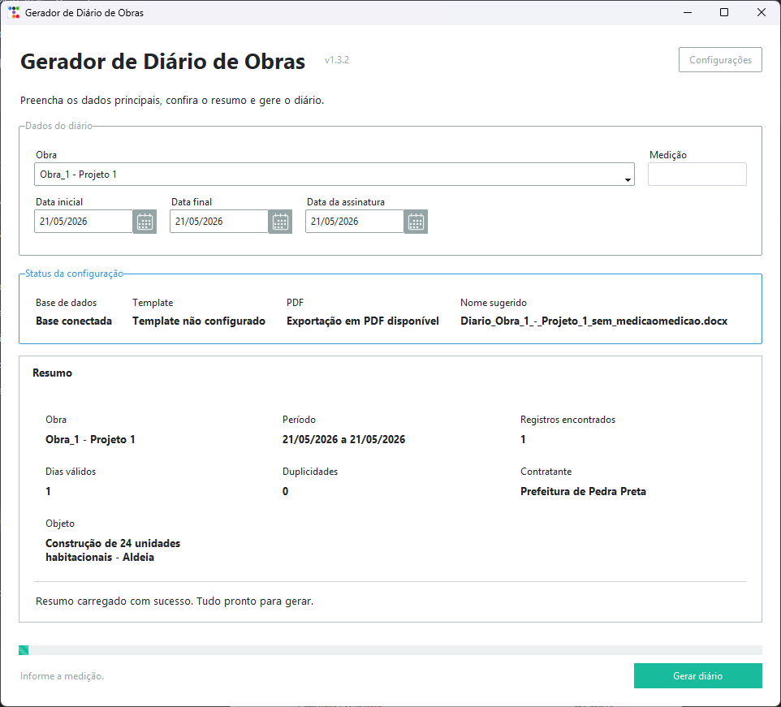
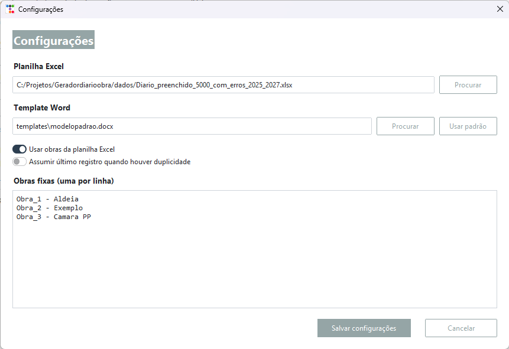

# Gerador de Diário de Obras

[](https://github.com/GUILHERME-GARCIATECH/geradordiarioobras/actions/workflows/build.yml)

Aplicativo desktop para gerar diários de obra em Word a partir de uma planilha Excel. Ele lê os registros diários, cruza os dados com o cadastro da obra, monta um diário para cada dia do período informado e exporta o documento usando um template `.docx`.

O projeto foi pensado para um fluxo simples: selecionar a base Excel, escolher a obra, informar período/medição/data de assinatura e gerar o diário em `.docx`. Em computadores com Microsoft Word instalado, também é possível exportar em PDF.

## Screenshots

### Tela inicial



### Configurações



## Funcionalidades

- Interface desktop em Tkinter com `ttkbootstrap`.
- Seleção de planilha Excel e template Word pela tela de configurações.
- Listagem automática de obras a partir da aba de respostas.
- Suporte a obras fixas quando a listagem via Excel estiver desativada.
- Resumo antes da geração: total de registros, dias do período, duplicidades, contratante e objeto.
- Geração de diário para todos os dias do período, incluindo dias sem registro com atividade padrão.
- Tratamento opcional de duplicidade por obra/data usando o último registro do dia.
- Exportação `.docx`.
- Exportação `.pdf` quando o Microsoft Word estiver disponível no Windows.
- Build automatizado no GitHub Actions com artefatos de `.exe` e instalador.

## Stack

- Python 3.12
- Tkinter / ttkbootstrap
- openpyxl
- docxtpl
- PyInstaller
- Inno Setup para gerar instalador Windows

## Estrutura do Projeto

```text
.
├── app.py                         # Interface desktop
├── main.py                        # Orquestra leitura, filtros e geração
├── config.py                      # Configurações de nomes de abas e etapas
├── src/
│   ├── diario_builder.py          # Montagem do contexto de cada diário
│   ├── excel_reader.py            # Leitura de planilhas
│   ├── filtros.py                 # Filtros por obra e período
│   ├── tarefas.py                 # Extração das tarefas por etapa
│   └── word_generator.py          # Renderização do template Word
├── templates/
│   └── modelopadrao.docx          # Template oficial do diário
├── assets/
│   ├── icone.ico
│   └── instalador_gerador_diario.iss
├── docs/images/                   # Imagens usadas nesta documentação
├── scripts/
│   ├── validate_project.py        # Validação estrutural e sintaxe
│   └── smoke_generate.py          # Smoke test de geração DOCX
├── .github/workflows/build.yml    # Pipeline de build Windows
├── GeradorDiarioObra.spec         # Spec do PyInstaller
├── requirements.txt               # Dependências de execução
└── requirements-build.txt         # Dependências de build
```

## Pré-requisitos

Para rodar a partir do código:

- Windows 10 ou superior recomendado.
- Python 3.12.
- Uma planilha Excel no formato esperado.
- O arquivo `templates/modelopadrao.docx`.

Para exportar em PDF:

- Microsoft Word instalado na máquina.

Para gerar instalador localmente:

- Inno Setup 6 instalado.

## Instalação para Desenvolvimento

No PowerShell, a partir da raiz do projeto:

```powershell
python -m venv .venv
.\.venv\Scripts\Activate.ps1
python -m pip install --upgrade pip
pip install -r requirements.txt
python app.py
```

Para instalar também as dependências de build:

```powershell
pip install -r requirements-build.txt
```

## Formato da Planilha

Por padrão, o app espera uma planilha chamada `base.xlsx` quando nenhum caminho é informado. Na interface, o caminho pode ser escolhido livremente em **Configurações**.

A planilha precisa ter duas abas:

- `resposta_forms`
- `cadastro_obras`

### Aba `resposta_forms`

Colunas usadas pelo app:

```text
obra
data
tempo_manha
interrupcao_manha
tempo_tarde
interrupcao_tarde
mestre_de_Obras
eletricista
pedreiro
servente
encanador
pintor
etapa
fundação
estrutura
alvenaria
cobertura
instalações
acabamento
outros_procedimentos
ocorrencias
```

As tarefas de cada etapa devem ser separadas por ponto e vírgula. Exemplo:

```text
Locação de eixos;Escavação;Concretagem de sapata;
```

### Aba `cadastro_obras`

Colunas usadas pelo app:

```text
obra_id
objeto
contrato
contratante
endereco
fiscal
Crea-MT
```

O campo `obra_id` deve corresponder ao identificador inicial usado em `resposta_forms`, por exemplo `Obra_1` para registros como `Obra_1 - Projeto 1`.

## Template Word

O template padrão fica em:

```text
templates/modelopadrao.docx
```

Esse arquivo deve conter a estrutura visual do diário e os campos usados pelo `docxtpl`. Como normalmente o template pode conter dados de empresa, logotipo, assinatura ou informações contratuais, revise e remova qualquer informação sensível antes de publicar o repositório.

O `.gitignore` já permite versionar especificamente `templates/modelopadrao.docx`, mas mantém documentos gerados (`*.docx`, `*.pdf`) fora do Git.

## Rodando Validações

Validação estrutural e sintaxe:

```powershell
python -B scripts/validate_project.py
```

Smoke test de geração DOCX:

```powershell
python -B scripts/smoke_generate.py
```

O smoke test cria uma base Excel mínima em `build/ci-smoke/`, gera um diário e verifica se ainda existem placeholders não renderizados no `.docx`.

## Gerando o Executável

Instale as dependências de build e rode o PyInstaller:

```powershell
pip install -r requirements-build.txt
pyinstaller --noconfirm --clean GeradorDiarioObra.spec
```

O executável será gerado em:

```text
dist/GeradorDiarioObra.exe
```

## Gerando o Instalador

Depois de gerar o `.exe`, compile o script do Inno Setup:

```powershell
& "${env:ProgramFiles(x86)}\Inno Setup 6\ISCC.exe" assets\instalador_gerador_diario.iss
```

O instalador será salvo em:

```text
assets/instalador/
```

## GitHub Actions

A pipeline em `.github/workflows/build.yml` roda em `windows-latest` e executa:

1. Instalação das dependências.
2. Validação de arquivos obrigatórios e sintaxe.
3. Smoke test de geração DOCX.
4. Build do `.exe` com PyInstaller.
5. Build do instalador com Inno Setup.
6. Upload dos artefatos:
   - `GeradorDiarioObra-exe`
   - `GeradorDiarioObra-installer`

Em pushes de tags iniciadas com `v`, por exemplo `v1.3.2`, a pipeline também publica uma GitHub Release com o `.exe` e o instalador:

```powershell
git tag v1.3.2
git push origin v1.3.2
```

## Arquivos Locais e Dados Sensíveis

Os seguintes itens ficam fora do Git:

- `.venv/`
- `build/`
- `dist/`
- `assets/instalador/`
- `dados/`
- `base.xlsx`
- documentos gerados em `.docx` e `.pdf`

Use a pasta `dados/` para bases reais, bases de teste grandes ou arquivos com informações sensíveis.

## Solução de Problemas

### "Template Word não encontrado"

Confirme se existe um arquivo em:

```text
templates/modelopadrao.docx
```

Se você estiver usando o executável instalado, confira se o instalador copiou o template para a pasta do app.

### "Arquivo Excel não encontrado"

Abra **Configurações** e selecione a planilha correta. O caminho fica salvo em:

```text
%LOCALAPPDATA%\GeradorDiarioObra\config.json
```

### PDF indisponível

A exportação em PDF depende do Microsoft Word via automação COM (`pywin32`). Em máquinas sem Word instalado, gere `.docx`.

### Build falha no GitHub Actions por falta de template

Antes de subir o repositório, adicione o template sanitizado em:

```text
templates/modelopadrao.docx
```

## Licença

Licença ainda não definida.
